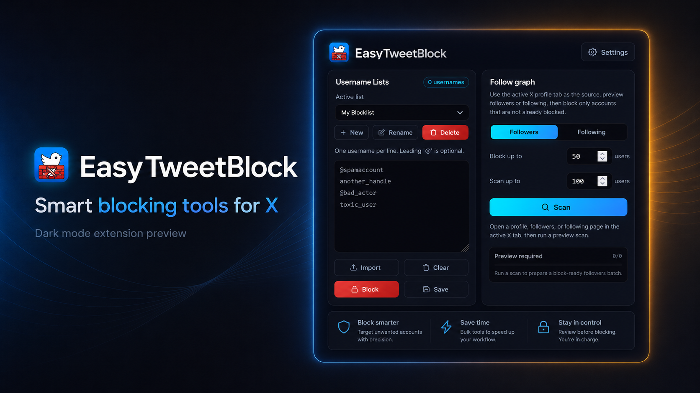

# Easy TweetBlock

Browser extension for managing blocked accounts on X/Twitter.

## Features

- Add block controls to tweets, profiles, and user rows.
- Save usernames in multiple named lists.
- Import usernames from TXT, CSV, or JSON files.
- Block a saved list immediately through an open X/Twitter tab.
- Scan followers or following, preview candidates, skip already blocked accounts, and block selected batches.
- Add follower candidates to a username list or cancel an active block run.
- Customize button style and visibility, and set the delay between blocks.
